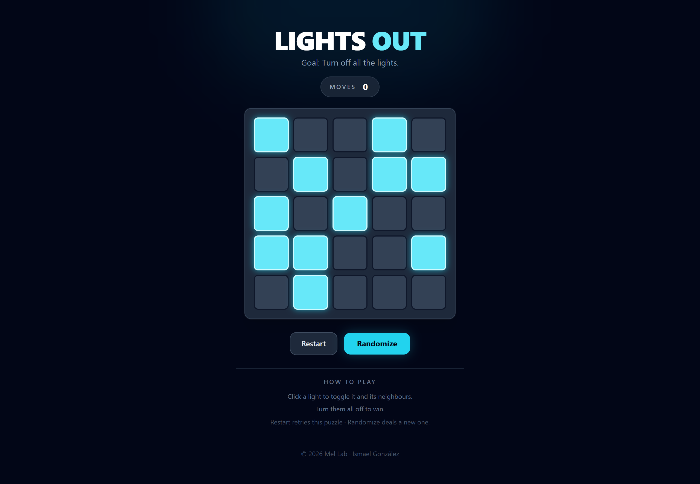
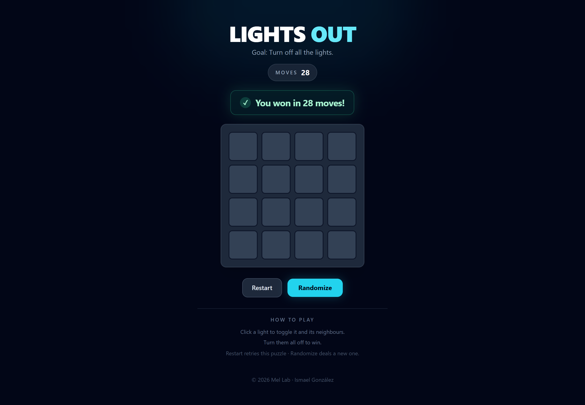

<p align="center">
  
</p>

<p align="center">
  A small Lights Out puzzle game built with plain PHP, no frameworks.<br>
  Click a light to toggle it and its neighbours — turn them all off to win.
</p>

## Screenshots

<table>
  <tr>
    <td align="center" width="50%">
      <br>
      <sub>Mid-game board</sub>
    </td>
    <td align="center" width="50%">
      <br>
      <sub>Win state</sub>
    </td>
  </tr>
</table>

## Features

- Random board size between 3x3 and 6x6.
- Clicking a cell toggles itself and its orthogonal neighbours.
- Move counter with live updates.
- `Restart` retries the current puzzle.
- `Randomize` generates a new solvable puzzle.
- Win detection with move count.
- Responsive interface.

## How to Play

1. Click a light to toggle it and its orthogonal neighbours.
2. Turn off all the lights to win.
3. Use `Restart` to retry the current puzzle, or `Randomize` for a new one.

## Quickstart

Requirements: PHP 8+ (no Composer, no build step).

Start the built-in server from the project folder:

```bash
php -S localhost:8000
```

Then open in your browser:

```text
http://localhost:8000/index.php
```

## Tech Stack

- PHP, no frameworks.
- Tailwind CSS via CDN.
- PHP sessions for game state.

Board generation: each game starts from an all-OFF board with random size 3–6, then applies random valid moves. This keeps the random size while ensuring boards are reachable and never start already solved.

## Project Structure

```text
.
├── index.php              # Controller and session state
├── LightsOutGame.php      # Game logic and board generation
├── BoardView.php          # HTML presentation
└── assets/
    ├── logo-lights-out.png
    ├── Lights-out-favicon.svg
    ├── screenshoot-lights-out.png
    └── screenshoot-lights-out-win.png
```

## Author

© 2026 Mel Lab · Ismael González
